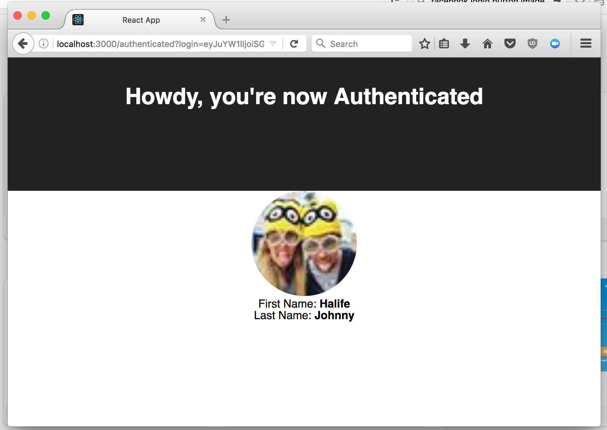

# QA Technical Exercise

### Getting started
Fork this project.

---
## PART ONE
For this part, this repository contains the source of an application to be tested. It's a simple client (web) and server application (api).

There's something wrong, and it'll be up to you to report it. Create a reproducible test case, and see how far you can get on your report.

**Can you spot the issue?**



#### Objective
This exercise has several objectives, and we'll evaluate not only the results but the process that led you to it.

1. Report the bug as if it should be reported for developers to fix it.
2. Create an automated tests that asserts that the observed behavior is wrong and that passes once the issue has been resolved.
3. Within the `server` folder there's a unit test, even though the test passes there's something wrong about it, can you fix it?
4. Can you spot the offending line of code / file / section that's causing this issue?

Please keep track of all your decisions and document your process along the way, what did you do? how you did it? and most important why you did it?

**NOTE**: For the automated testing you can use the language of your choice, and the framework of your choice. As long as the exercise comes back with the required steps for running the test.

#### Prerequisites
In order to run this application you will need to have GIT and Docker installed:

* **Docker**. Get docker from [https://docs.docker.com/engine/installation/](https://docs.docker.com/engine/installation/)

* **GIT**. Get GIT from [https://git-scm.com/](https://git-scm.com/)

#### Configuring the environment
Using the configuration settings sent to you email, please update your `server/config/defaults.json` accordingly to be able to run the tests.

```json
{
  "auth": {
    "domain": "auth0-domain",
    "clientId": "auth0-client-id",
    "clientSecret": "auth0-client-secret"
  }
}
```

#### Running the app
Once you have checked out the app and installed docker, you just need to run:

```bash
$ docker-compose up
```

This will make the app (both server and client to be running on your machine).

When the app is running, the output should look like this

```bash
# johnnyhalife@westeros.local ~/Documents/GitHub/qa-excersice
λ docker-compose up
WARNING: Image for service server was built because it did not already exist. To rebuild this image you must use `docker-compose build` or `docker-compose up --build`.
Creating qa-exercise_server_1 ... done
Creating qa-exercise_client_1 ... done
Attaching to qa-exercise_server_1, qa-exercise_client_1
client_1  |
client_1  | > client@0.1.0 start /usr/src
client_1  | > react-scripts start
client_1  |
server_1  | Server is ready, listening on port 5000
client_1  | Starting the development server...
client_1  |
client_1  | Compiled successfully!
client_1  |
client_1  | The app is running at:
client_1  |
client_1  |   http://localhost:3000/
client_1  |
client_1  | Note that the development build is not optimized.
client_1  | To create a production build, use npm run build.
client_1  |
```

Open your web browser and navigate to [http://localhost:3000](http://localhost:3000)

####  Running the Unit Test of the Server App
The server app has a unit test set up. To run the unit test you can do the following

```bash
$ > cd server
$ > docker build -t server .
$ > npm install
$ > docker run -v $PWD:/usr/src server npm test
```

#### About the app
The app is built using the `create-app` from React, so it's just a boilerplate.

And the server has been bootstraped with `express.js` on NodeJs.

---
## PART TWO
In this part, we are interested in your approach to the following problems.

Please do the test in Selenium with a proper Object Oriented Programming language, using automated testing best practices and BDD gherkin language to define the acceptance tests. This is expected to take no more than 2 hours.

#### To start
- Create a new directory name part_two and put all your files in it for this part.
- Commit each exercise once you've finished with it.

#### Exercise #1
- Create Page Object Model framework for [https://rise.capital](https://rise.capital) to do the exercise 2 & 3
- Use the `driver manager` pattern. We should be able to run the test framework against Chrome, Firefox and Microsoft Edge browsers

#### Exercise #2
Click on the "Products" Menu
- Assert that the "Build Wealth" is included in the submenu list
- Click on the "Build Wealth" submenu
- Capture and Print all text in H1 tag on the page

#### Exercise #3
- a. Complete the "Start building your future" form to calculate the wealth value for Tope, who is 25 years old and earns N350,000 monthly. Being a young engineer, he thinks "Stability" is more important to him if he saves 20% of his monthly income.
- b. Verify and print the wealth value for Tope when he retires at the age of 60.

#### Exercise #4
README file - Include instructions on how to set up and execute your tests on a clean install of Windows/MacOS/Linux inside the directory created earlier
Bonus point: Test execution on Docker instances

----

### Submission?
Check instruction included in the email sent to you.
### Questions? Feedback? Concerns

Don't hesitate to reach out
